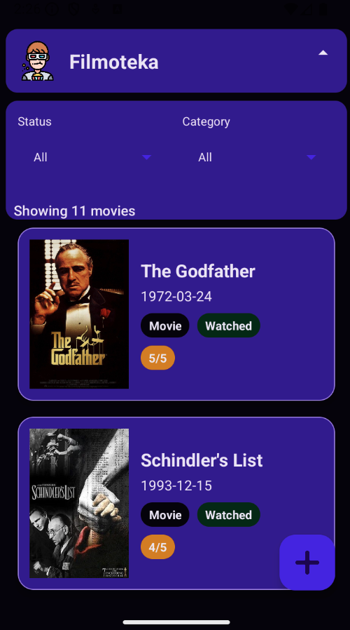
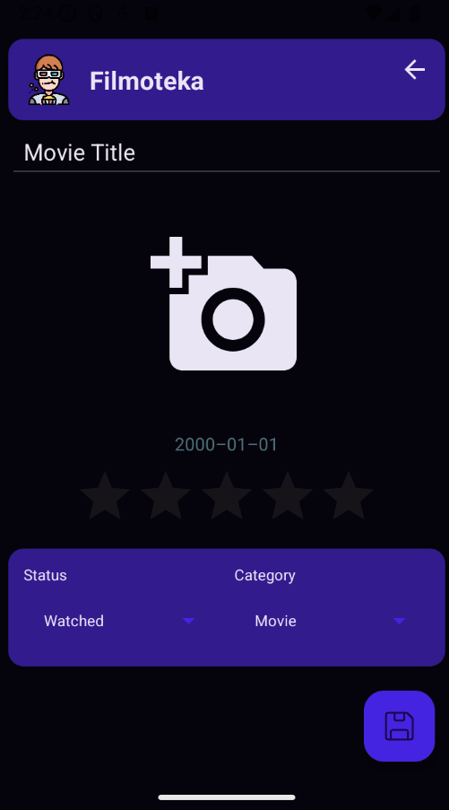
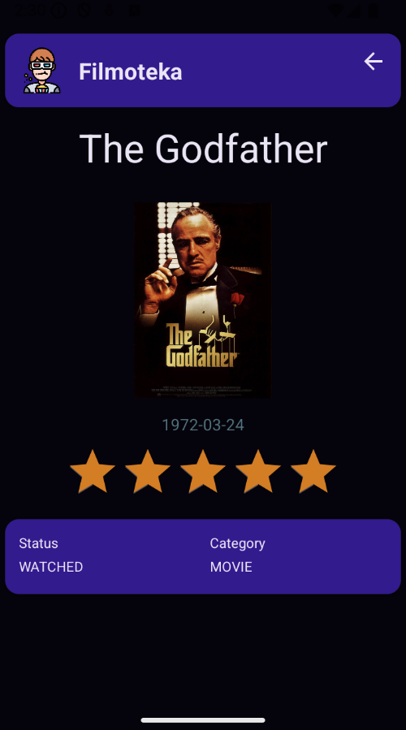

# 🎬 Filmoteka – Personal Movie Library App

📱 **Filmoteka** is a Kotlin-based Android app that lets you manage your personal library of movies, series, and documentaries.  
Add, edit, filter, and browse your watched and to-watch list – all in one place!

> 🏫 This project was originally developed for the **Mobile Programming** course at  
> **Polish-Japanese Academy of Information Technology** (PJAIT) in Warsaw.

---

## 🧩 Features

- 🎥 Add movies, series, or documentaries with posters
- 📅 Set and view release dates
- ✅ Mark items as *watched* or *not watched*
- ⭐ Rate watched movies from 0 to 5
- 🔍 Filter by category and status
- ♻️ Smooth list updates with DiffUtil
- 🧪 Strong validation via value classes
- 🛑 Custom error handling with localized messages

---

## 🖼️ Screenshots

| 🏠 Main Screen                  | ➕ Add Movie                       | 🔍 Details View                     |
|---------------------------------|-----------------------------------|-------------------------------------|
|  |  |  |

---

## 🚀 Getting Started

1. Clone the repo  
   ```bash
   git clone https://github.com/your-username/filmoteka.git
   ```
2. Open with Android Studio

3. Run the app on a device or emulator

## 🙌 Author
👨‍💻 Developed by Oskar Kalbarczyk

📚 Created as part of coursework at Polish-Japanese Academy of Information Technology

## 📄 License
MIT License – feel free to use, modify, and contribute!
